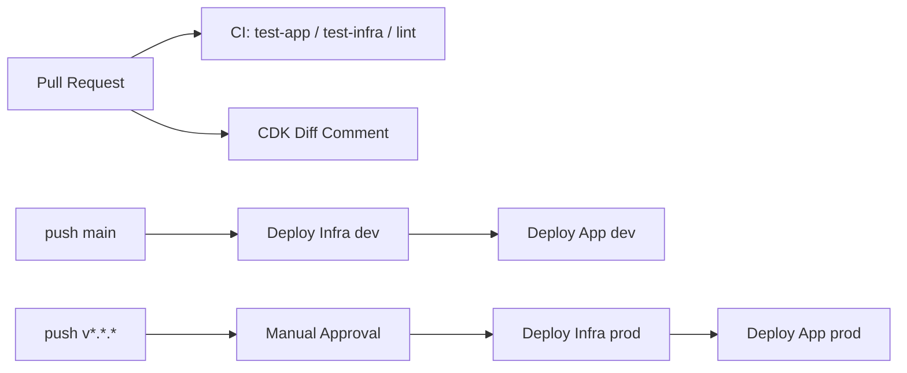

# CI/CDガイド

## 構成
- `ci.yml`: PR/Push時のアプリ・インフラテストとLint
- `deploy-dev.yml`: `main` push時のdev自動デプロイ
- `deploy-prod.yml`: `v*.*.*` tag push時のprod承認付きデプロイ
- `cdk-diff.yml`: PR時のCDK差分コメント投稿

## ワークフロー図


## GitHub Environments
- `dev`
  - Secret: `AWS_ROLE_ARN_DEV`
- `prod-approval`
  - Required reviewers: 1以上
- `prod`
  - Required reviewers: 1以上
  - Secret: `AWS_ROLE_ARN_PROD`

## 必須Secrets
- `AWS_ROLE_ARN_DEV`
- `AWS_ROLE_ARN_PROD`
- `CODECOV_TOKEN`（任意: カバレッジ連携時）

## AWS OIDC設定
1. OIDCプロバイダー作成
```bash
aws iam create-open-id-connect-provider \
  --url https://token.actions.githubusercontent.com \
  --client-id-list sts.amazonaws.com \
  --thumbprint-list 6938fd4d98bab03faadb97b34396831e3780aea1
```
2. IAMロール作成（dev/prodそれぞれ）
- Trust policy の `sub` は `repo:<OWNER>/<REPO>:*` を指定
- Permission は最小権限で `cloudformation`, `s3`, `cloudwatch`, `sns`, `iam:PassRole` など必要最小限

## デプロイ前提
- `infra` スタックに以下のCloudFormation Outputsを追加しておくこと
  - `AppBucketName`
  - `CloudFrontDistributionId`（CloudFront利用時）
- アプリ配布物を `out` に生成すること（`deploy-*.yml` の `APP_DIST_DIR`）

## トラブルシューティング
- `Build output directory not found`
  - `APP_DIST_DIR` が実際の成果物ディレクトリと一致しているか確認
- `App bucket output is empty`
  - Storage stackにOutputが定義されているか確認
- `AccessDenied` on deploy
  - OIDCロールのTrust/Permission policyを確認
- `cdk diff` が失敗
  - `infra/requirements.txt` とCDKバージョン整合性、Bootstrap状態を確認

## ベストプラクティス
- 長期アクセスキーは使用せずOIDCのみ利用
- dev/prodでロールを分離
- `cdk-diff` をPRゲートとして活用
- キャッシュ設定（HTML短期、JS/CSS長期）を維持
